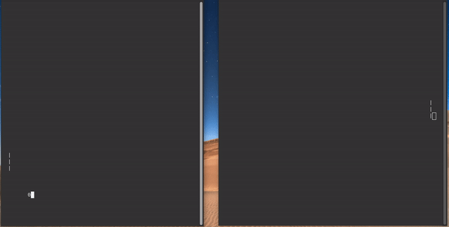
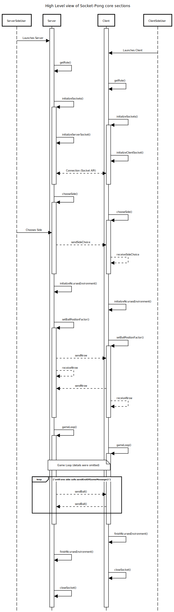

# Socket-Pong
Simple terminal pong game made with ncurses. The Networking portion was implemented using sockets.

<p align="center">
  
</p>

## Table of Contents
- [Dependencies](#dependencies)
- [Compiling](#compiling)
- [Usage](#usage)
  - [Server side](#server-side)
  - [Client side](#client-side)
- [General Info](#general-info)
- [Docs](#docs)
- [License](#license)
- [Disclaimer](#disclaimer)

## Dependencies

- GNU/Linux environment.
- Ncurses library (Tested with `libncurses-dev` on version 6.3-2ubuntu0.1).

## Compiling

Navigate to the root of the project and use `make`.
```
make
```

## Usage

### Server side

Use the flag `-s` to indicate that you are the server. And choose a port with the `-p` flag.
```
./Socket-Pong -s -p xxxxx
```

### Client side

Use the flag `-c` to indicate that you are the client. And choose the hostname and the port of the server with the `-h` and `-p` flags respectively.
```
./Socket-Pong -c -h xxx.xxx.xxx.xxx -p xxxxx
```

## General Info

- Not screen resize tolerant.
- Sometimes, after closing the program, the socket might be temporally on `TIME_WAIT` state. You may try a different port and/or wait untill the socket is released.

## Docs


## License
This project is licensed under the GPL v3 License. See the [LICENSE](LICENSE) file for details.

## Disclaimer

In addition to the warranty disclaimers in the GPL license, the software is provided "as is" and without any further warranties or guarantees. The author shall not be held liable for any damages resulting from the use of this software.
